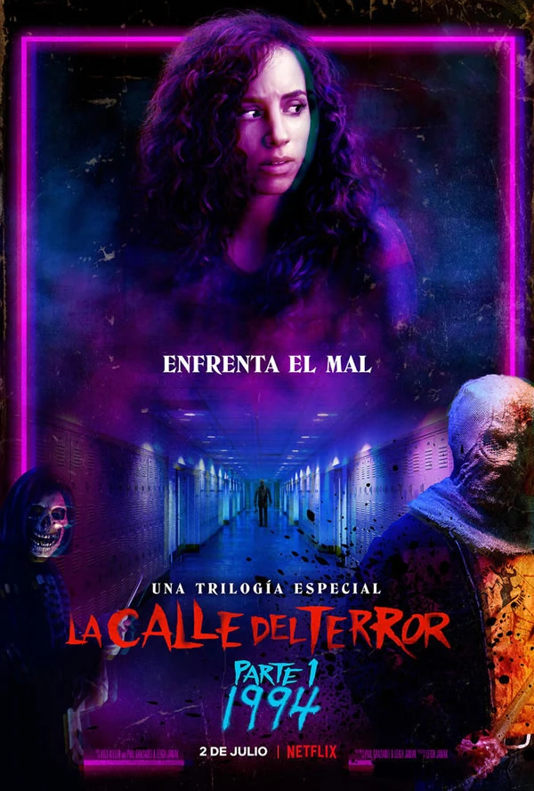
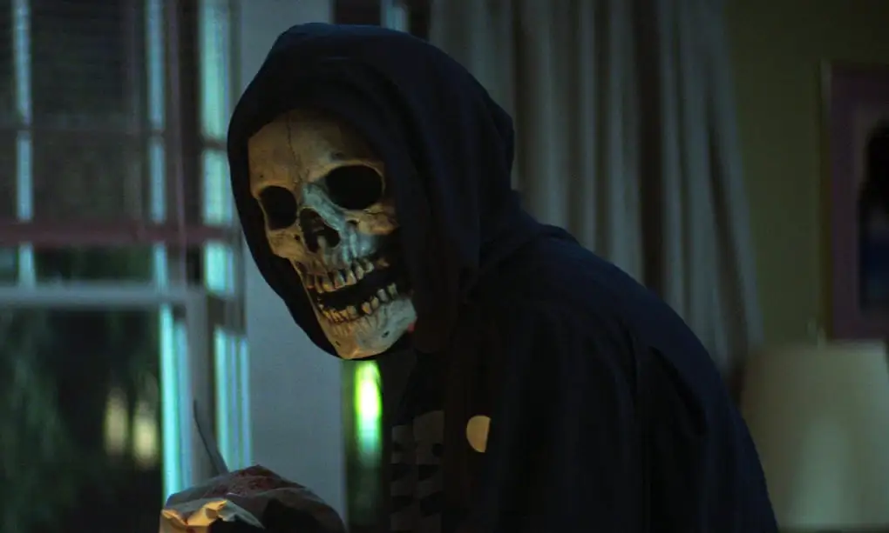

La tematica de nuestra pagina web La Calle del Terror – Trilogía

La Calle del Terror es una saga de películas de terror que gira en torno a una serie de asesinatos que ocurren a lo largo de los años en el pueblo maldito de Shadyside. La historia se divide en tres partes, cada una ambientada en una época distinta, pero conectadas entre sí por una maldición oscura que ha marcado al pueblo durante generaciones.

Parte 1: 1994
Tras una nueva ola de asesinatos, un grupo de adolescentes de Shadyside comienza a investigar el origen de las tragedias que han azotado su comunidad durante décadas. A medida que descubren más detalles, se dan cuenta de que todo está relacionado con una antigua maldición que parece provenir de una bruja.

Parte 2: 1978
La historia se traslada a un campamento de verano, donde se desata una masacre. Aquí conocemos a la única sobreviviente de esa tragedia, quien relata cómo comenzaron los asesinatos. Uno de los protagonistas encuentra el cuerpo de la supuesta bruja, y el grupo descubre que la maldición está más viva que nunca. Mientras tanto, los jóvenes deben luchar por sus vidas para escapar de un asesino descontrolado.

Parte 3: 1666
Esta última parte revela el verdadero origen de la maldición. En el año 1666, una joven es acusada de brujería y condenada a muerte tras ser vista besando a otra mujer. La situación es manipulada por un hombre que la acusa injustamente. Finalmente, se revela que la familia Goode ha estado perpetuando la maldición en Shadyside para beneficiar a su pueblo vecino, Sunnyvale, que prospera mientras Shadyside sufre. 

Readme:
# Proyecto: Informacion sobre la trilogia original de fear street o la calle del terror- Aplicación Web CRUD

Este repositorio contiene el desarrollo de una aplicación web básica con funcionalidad **CRUD (Crear, Leer, Actualizar, Eliminar)**, orientada la informacion acerca de la trilogia de la calle del terror. Está diseñado con fines informativos para apoyar la enseñanza del desarrollo web con **HTML, CSS, JavaScript, Python (Flask)** y **MySQL**.

**Correo de contacto:** lennethnaveas@liceovvh.cl   daniellefigueroa@liceovvh.cl

---

## Temática a trabajar

La temática principal de este proyecto es la de **Informar sobre la trilogia original de la calle del terror**, simulando una plataforma donde los usuarios puedan informarse sobre:

- Los protagonistas de cada saga.
- Los personajes secundarios.
- Curiosidades de cada pelicula.
- Los asesinos de cada pelicula.

Este enfoque permite contextualizar los eventos ocurridos a lo largo de estas 3 peliculas, facilitando la comprensión de los conceptos relacionados con el desarrollo de la historia.

---

## Objetivo del proyecto

El objetivo general es que el estudiante pueda **diseñar, construir y documentar una aplicación CRUD funcional**, comprendiendo la relación entre la interfaz de usuario, el servidor y la base de datos.

---

## Herramientas y tecnologías utilizadas

- **Frontend:** HTML5, CSS3, Bootstrap, JavaScript
- **Backend:** Python 3, Flask
- **Base de datos:** MySQL
- **Entorno de desarrollo:** VSCode
- **Control de versiones:** Git y GitHub

---

## Estructura del proyecto

* {
    box-sizing: border-box;
    margin: 0;
    padding: 0;
}

html, body {
    height: 100%;
}

body {
    font-family: 'Segoe UI', sans-serif;
    background-color: #f2f4f8;
}

.contenedor {
    display: flex;
    height: 100%;
}

/* NAV */
.nav {
    background-color: #37474f;
    color: white;
    min-width: 200px;
    flex: 1;
    max-width: 300px;
    padding: 20px;
}

.nav h2 {
    margin-bottom: 20px;
}

.nav ul {
    list-style: none;
}

.nav li {
    margin: 10px 0;
}

.nav a {
    text-decoration: none;
    color: white;
    transition: 0.3s;
}

.nav a:hover {
    color: #ffd54f;
}

/* CONTENIDO */
.contenido {
    flex: 4;
    padding: 30px;
}

/* GALERÍA */
.galeria {
    display: flex;
    flex-direction: column;
    gap: 40px;
    margin-top: 20px;
}

.galeria section {
    display: flex;
    flex-direction: column;
    gap: 15px;
}

.galeria h2 {
    font-size: 1.2rem;
    color: #37474f;
    margin-bottom: 10px;
}

/* Tarjetas generales */
.tarjeta {
    width: 100%;
    padding: 30px;
    border-radius: 10px;
    background-color: #fff;
    text-align: center;
    box-shadow: 0 0 10px rgba(0, 0, 0, 0.1);
    transition: transform 0.3s ease;
}

.tarjeta:hover {
    transform: scale(1.05);
}

/* Tarjeta 1 con imagen centrada y más pequeña */
.tarjeta1 {
    background-color: #2933aa;
    display: flex;
    flex-direction: column;
    align-items: center;
}

.tarjeta1 img {
    width: 200px;
    height: auto;
    border-radius: 10px;
    margin-top: 10px;
}

* {
    box-sizing: border-box;
    margin: 0;
    padding: 0;
}

html, body {
    height: 100%;
}

body {
    font-family: 'Segoe UI', sans-serif;
    background-color: #f2f4f8;
}

.contenedor {
    display: flex;
    height: 100%;
}

/* NAV */
.nav {
    background-color: #37474f;
    color: white;
    min-width: 200px;
    flex: 1;
    max-width: 300px;
    padding: 20px;
}

.nav h2 {
    margin-bottom: 20px;
}

.nav ul {
    list-style: none;
}

.nav li {
    margin: 10px 0;
}

.nav a {
    text-decoration: none;
    color: white;
    transition: 0.3s;
}

.nav a:hover {
    color: #ffd54f;
}

/* CONTENIDO */
.contenido {
    flex: 4;
    padding: 30px;
}

/* GALERÍA */
.galeria {
    display: flex;
    flex-direction: column;
    gap: 40px;
    margin-top: 20px;
}

.galeria section {
    display: flex;
    flex-direction: column;
    gap: 15px;
}

.galeria h2 {
    font-size: 1.2rem;
    color: #37474f;
    margin-bottom: 10px;
}

/* Tarjetas generales */
.tarjeta {
    width: 100%;
    padding: 30px;
    border-radius: 10px;
    background-color: #fff;
    text-align: center;
    box-shadow: 0 0 10px rgba(0, 0, 0, 0.1);
    transition: transform 0.3s ease;
}

.tarjeta:hover {
    transform: scale(1.05);
}

/* Tarjeta 1 con imagen centrada y más pequeña */
.tarjeta1 {
    background-color: #2933aa;
    display: flex;
    flex-direction: column;
    align-items: center;
    width: 500px;
    
}

.tarjeta1 img {
    width: 200px;
    height: auto;
    border-radius: 10px;
    margin-top: 10px;
}

/* Otras tarjetas */
.tarjeta2 { background-color: #5e0f99; }
.tarjeta2 img {
    width: 200px;
    height: auto;
    border-radius: 10px;
    margin-top: 10px;
}
.tarjeta3 { background-color: #343686; }
.tarjeta3 img {
    width: 200px;
    height: auto;
    border-radius: 10px;
    margin-top: 10px;
}
.tarjeta4 { background-color: #e60fe4; }
.tarjeta5 { background-color: #ba68c8; }

.tarjeta6 { background-color: #280d0a; }
.tarjeta7 { background-color: #692a0a; }
.tarjeta8 { background-color: #6c180c; }
.tarjeta9 { background-color: #f3b033; }
.tarjeta10 { background-color: #ad4c16; }

.tarjeta11 { background-color: #1d0a09; }
.tarjeta12 { background-color: #354d36; }
.tarjeta13 { background-color: #245c48; }
.tarjeta14 { background-color: #ffb74d; }
.tarjeta15 { background-color: #ff8a65; }

<!DOCTYPE html>
<html lang="es">

<head>
    <meta charset="UTF-8" />
    <meta name="viewport" content="width=device-width, initial-scale=1.0" />
    <title>Sitio Temático Flex</title>
    <link rel="stylesheet" href="style.css" />
</head>

<body>
    

        <nav class="nav">
            <h2> 🔍 Explorador</h2>
            <ul>
                <li><a href="#">Inicio</a></li>
                <li><a href="#">Galería</a></li>
                <li><a href="#">Fav</a></li>
                <li><a href="#">disgusto</a></li>
            </ul>
        </nav>

        <main class="contenido">
            <h1>🎞🎞🎥 La trilogia original de la calle del terror</h1>
            

                <h2>☠️🔪🩸 La calle del terror parte 1 1994</h2>
                

                    <h1>La Portada</h1>
                    
                

                
<h1>Asesinos</h1>
                    
                    

                
<h1>Protagonista</h1>
                    
                    
                    
                    
                    
                
                      
                
Los otro asesinos

                
La curiosidad

            </section>
            <section class="part2">
                <h2>🪓🔥🏕️ La calle del terror parte 2 1978</h2>
                
la calle del terror parte 2 1978

                
Protagonista

                
Asesinos

                
Los otros asesinos

                
La curiosidad

            </section>
            <section class="part3">
                <h2>🔮🩸Ψ La calle del terror parte 3 1666</h2>
                
la calle del terror parte 3 1666

                
Protagonista

                
Asesinos 1

                
el villano de la trilogia

                
La curiosidad

            </section>
            

            
        </main>
    

</body>
</html>

